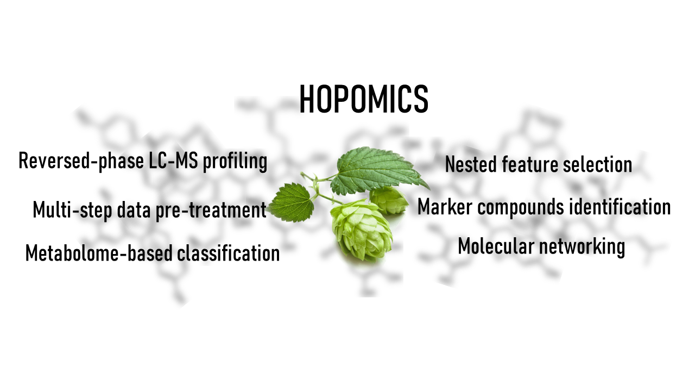

# Hopomics

A repository dedicated to data, related to omics studies _Humulus lupulus_ and related products by our group. We've recently published a paper in MDPI and few works are pending to be submitted. Here you can acces related processing scripts and files. 
We also publish here a _in-house_ fragmentation spectra database, which was constructed based on FBMN results obtained aftes Cascade cultivar profiling. More data on this study is going to be published soon.
Data presented in the "FBMN" folder is associated with recently submited article. Scripts for database creation, database itself and script for retention time calculation basedon SMRT dataset are presented in dedicated folders.

 R scripts may be used for fully data processing from raw data to peak table, including peak integration & alignment, QC-XGB signal correction and nested feature selection.

## Citation:
> [Ikhalaynen Y. A., Plyushchenko I. V., Rodin I. A. (2022). Hopomics: *Humulus lupulus* Brewing Cultivars Classification Based on LC-MS Profiling and Nested Feature Selection. Metabolites, 12(10), 945.](https://www.mdpi.com/2218-1989/12/10/945)

> _Comming soon Ikhalaynen Y. A., Vasilieva E.V., Rodin I. A. "Applying molecular networking to hopomics: an in-depth description of Humulus lupulus metabolome"_

## Dataset Ref:
> MassIVE: [MSV000089747](https://massive.ucsd.edu/ProteoSAFe/dataset.jsp?accession=MSV000089747)

Corresponding dataset contains two types of files: whole set of LC-HRMS profiling from _IT-TOF_, and raw data from _Orbitrap_ with MS2 fragmentation.

## Contact:
Please send any comment, suggestion or question you may have to the author (Mr. Yuriy Ikhalaynen), email: ikh.ya@yandex.ru.

<!-- badges: starts -->

<!-- badges: end -->
